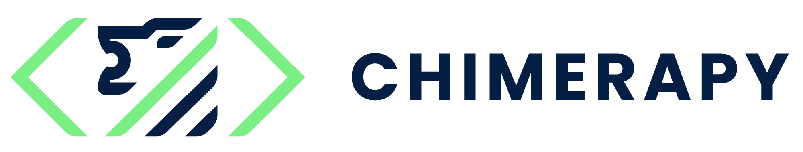

  

    <em>ChimeraPy is a Distributed Computing Framework For MultiModal Data</em>

ChimeraPy is a Python library/framework for creating and orchestrating distributed Multimodal data pipelines. It is built on top of [ChimeraPy-Engine](https//github.com/ChimeraPy/ChimeraPy-Engine): The framework that provides low level communication and data processing constructs for `ChimeraPy`.
